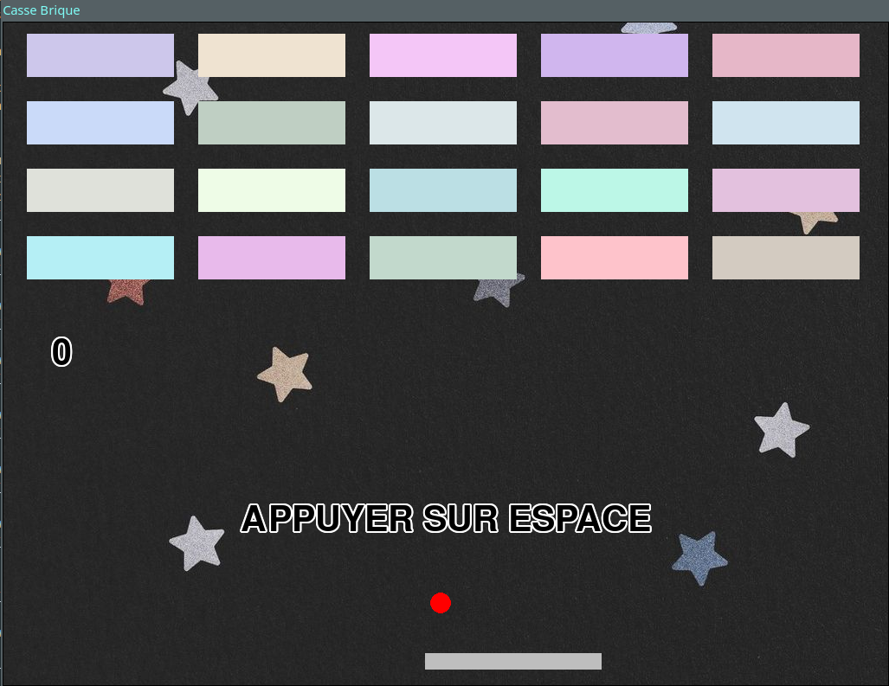

# Breakout

Simple breakout game with pygame and pgzero

## How to play ?

- Press space to start a game,
- Press left or right to move the paddle,
- Once the game is over, press space again to start a new game,
- Escape and Q exit the game.

And ?

That's it. It's a very simple game for a very young child.

